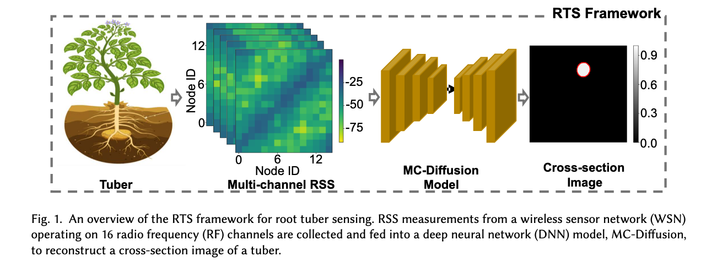
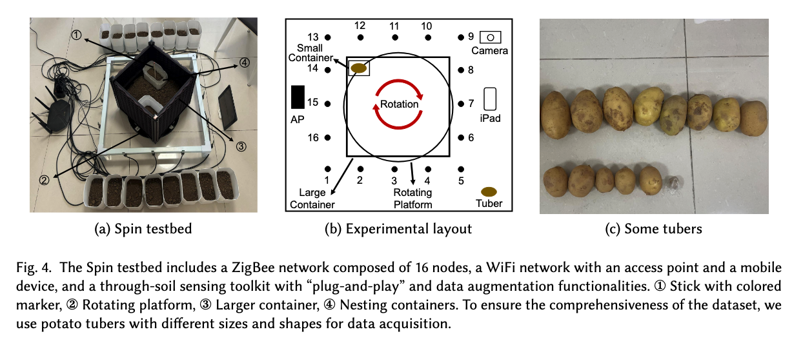
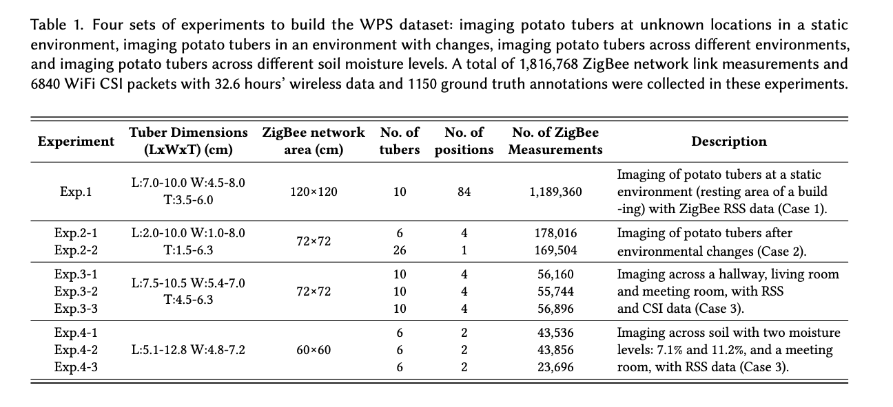
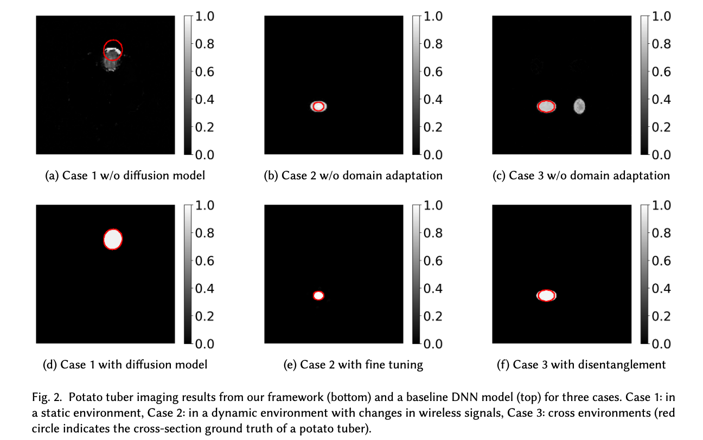
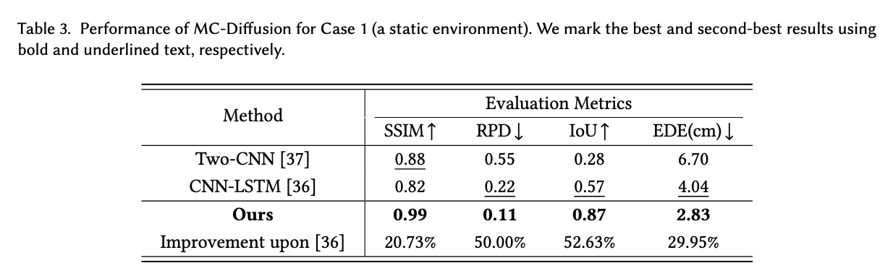
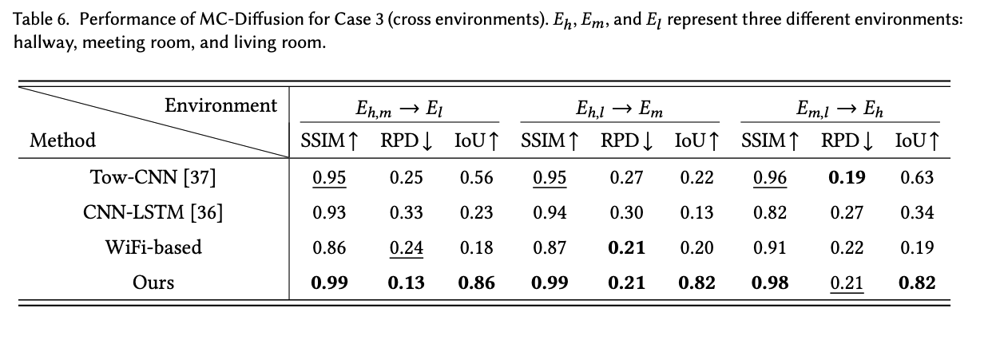

# RTS
We introduce RTS, a novel framework for underground tuber sensing, capable of imaging the cross-sections of underground tubers, including sizes, shapes, and positions, using a 
novel MC-Diffusion model and multi-channel received signal strength data. We extensively evaluate the imaging capabilities of the RTS and validate its effectiveness across multiple scenarios, including tuber imaging in a static environment, robust imaging under environmental changes, and cross-environment and cross-soil imaging for underground tubers. 


For data collection, we design a testbed named Spin, which includes various containers and a rotating platform.


To evaluate the performance of the RTS framework, we construct a comprehensive dataset consisting of data from a static environment (Case 1), a fixed environment with dynamic changes (Case 2), and various environments with diverse soil conditions (Case 3). 


We have released the pre-trained model and part of the corresponding data files in releases, which can be used for performance testing. 

## 1 Visualization Results
Some visualization results of the RTS framework and baseline methods are shown below. For demonstration purposes, we present imaging results from a static environment, a fixed environment with dynamic changes, and across different environments. 

As shown, the RTS framework generates images that accurately demonstrate sizes, shapes, and positions. 


# Prerequisite and Evaluation
## 2.1 Prerequisite
RTS is implemented with Python 3.10 and PyTorch 2.1.0. We manage the development environment using Conda. Execute the following commands to configure the development environment.
* Create a conda environment called RTS based on Python 3.10, and activate the environment.
```
conda create -n RTS python=3.10
conda activate RTS 
```
Install PyTorch, as well as other required packages, 
```
  pip3 install torch
  pip3 install scikit-learn==1.0.2
  pip3 install scikit-image==0.19.2
```
Download or git clone the RTS project. Download and unzip  Data.zip.zip and GroundTruth.zip in releases to the project directory. 
```
   unzip Data.zip -d [RTS root directory]
   unzip GroundTruth.zip -d [RTS root directory]
```

## 2.2 Evaluation for a static environment
We use four different metrics to quantitatively evaluate the performance of the RTS framework in a static environment, as well as that of baseline methods.

We evaluate the RTS framework in a static environment, where the RSS measurements are collected from tubers of varying sizes and positions. As shown, our approach achieves an SSIM score of 0.99, representing 12.50\% and 20.73\% improvements over Two-CNN and CNN-LSTM, two state-of-the-art data-driven models. Additionally, we quantify the estimation accuracy for underground tubers. As shown, our method achieves an IoU value of 0.87, much higher than 0.28 and 0.57 from the baseline methods. Meanwhile, our method achieves RPD and EDE values of 0.11 and 2.83, respectively, representing improvements of 26.6\% and 17.01\% compared to CNN-LSTM.


## 2.3 Evaluation for cross-environment imaging
We use different metrics to quantitatively evaluate the performance of the RTS framework for cross-environment imaging. The results of our model and the baseline methods are shown below.

We collect RSS data from three different environments: a hallway, a meeting room, and a living room. We denote these environments as $E_h$, $E_m$, and $E_l$, respectively. We evaluate our framework using the SSIM, RPD and IoU values reported in Table. First, our method consistently achieves the highest SSIM values across different environments, outperforming the baselines. Second, our method achieves the average RPD value of 0.19 in different environments, which is lower than those reported by Two-CNN~(0.24) and CNN-LSTM~(0.30). Third, our method achieves an average IoU value of 0.83, surpassing baseline methods, which report values of 0.47 and 0.23, respectively. 


